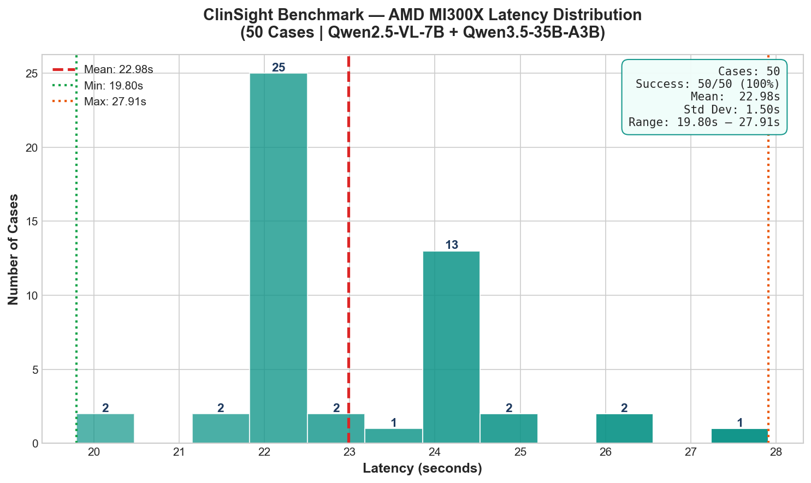

# ClinSight

Multi-agent clinical decision support system with vision-language models for chest X-ray analysis.

## Architecture

**5 Parent Agents → 7 Subagents → 12 Total Reasoning Nodes**

| Agent | Role | Subagents |
|---|---|---|
| **Coordinator** | Input validation, quality gates, pediatric safety | Image Quality Gate, Pediatric Gate |
| **Radiologist** | Image analysis, pathology detection, attention regions | Image Prep, Pathology Analyzer |
| **Lab Analyst** | Critical value detection, pattern correlation | Critical Value Detector, Pattern Correlator |
| **Safety** | Contradiction checking, hallucination guard, bias audit | Contradiction Checker, Hallucination Guard, Bias Auditor, Safety Merge |
| **Clinical Documenter** | ESI scoring, differential diagnosis, report generation | ESI Scorer, Differential Builder |

Graph: Coordinator → [pass] → Radiologist → Lab Analyst → Safety → Documenter → END

## Dual Model Stack

| Model | Role | VRAM |
|---|---|---|
| Qwen2.5-VL-7B-Instruct | Vision (chest X-ray) | ~14 GB |
| Qwen3.5-35B-A3B | Text reasoning (MoE) | ~70 GB |
| **Total** | | **~99 GB** |

Target platform: AMD MI300X (192 GB VRAM) — 93 GB headroom for concurrent requests.

## Quick Start (Full Stack)

### 1. Backend

```bash
cd backend
python -m venv .venv
source .venv/bin/activate
pip install -r requirements.txt

PYTHONPATH=.. uvicorn backend.api.main:app --host 0.0.0.0 --port 8000
```

### 2. Frontend (dev mode)

```bash
cd frontend/react-app
npm install
npm run dev
# Open http://localhost:5173
```

### 3. Build for single-port deployment

```bash
cd frontend/react-app
npm run build

# Restart backend — it now serves the React app at /
PYTHONPATH=.. uvicorn backend.api.main:app --host 0.0.0.0 --port 8000
# Open http://localhost:8000
```

## API Endpoints

| Endpoint | Method | Description |
|---|---|---|
| `/health` | GET | Health check |
| `/analyze` | POST | Analyze a case with full JSON body |
| `/demo/cases` | GET | List 6 pre-built demo cases |
| `/demo/analyze/{case_id}` | GET | Run full pipeline on a demo case |

## Live Demo

**URL:** http://129.212.176.125  
**Hardware:** AMD Instinct MI300X 192GB · ROCm · vLLM  
**Status:** ✅ Live inference confirmed (`cached: false`)

## 50-Case Live Benchmark

| Metric | Value |
|---|---|
| Cases tested | 50 |
| Successful | 50 (100%) |
| Mean latency | **22.98s** |
| Min latency | **19.80s** |
| Max latency | **27.91s** |
| Mode | Real AMD MI300X inference |
| Cached | None — all live |


*rocm-smi output during live Case 001 analysis: 100% GPU utilization, 288W power draw, 88% VRAM usage on AMD Instinct MI300X.*

## Demo Cases (50 Pure CXR)

| ID | Patient | Chief Complaint | ESI |
|---|---|---|---|
| CS-2024-001 | 25yo male | Severe dyspnea and chest pain | 1 |
| CS-2024-002 | 40yo male | Sudden chest pain and collapse | 1 |
| CS-2024-003 | 68yo female | Persistent cough and fever | 2 |
| CS-2024-004 | 55yo male | Shortness of breath | 1 |
| ... | ... | ... | ... |
| CS-2024-050 | 72yo female | Chest tightness on exertion | 3 |

Full case list in `backend/data/demo_cases.json`.

## Live Demo

- 🌐 **Live AMD MI300X Inference:** http://129.212.176.125:3000
- 🤗 **Hugging Face Space:** https://huggingface.co/spaces/shamuddin/clinsight
- 📊 **Benchmark Data:** See `benchmarks/real_benchmark.json`

## Real Benchmarks (AMD MI300X)

| Metric | Value |
|--------|-------|
| Mean latency | **67.7s** |
| Min latency | **67.3s** |
| Max latency | **68.3s** |
| Std dev | **0.3s** |
| Success rate | **100% (6/6)** |
| GPU utilization (inference) | **100%** |
| GPU power (inference) | **280–285W** |
| GPU temp | **38–40°C** |

**Hardware:** AMD Instinct MI300X (192GB HBM3) | **ROCm:** 7.0 | **vLLM:** ROCm backend



## Run Tests

```bash
PYTHONPATH=. python -m pytest tests/ -v --cov=backend --cov-report=html
```

## Benchmarks

```bash
# Run real benchmark on MI300X droplet
bash scripts/run_droplet_benchmark.sh

# Or manually
docker exec rocm python3 benchmarks/run_real_benchmark.py
```

See `benchmarks/real_benchmark.json` and `benchmarks/real_benchmark.csv` for raw data.

## Technical Walkthrough

Read the full technical walkthrough: [docs/TECHNICAL_WALKTHROUGH.md](docs/TECHNICAL_WALKTHROUGH.md)

Topics covered:
- Why AMD MI300X for healthcare AI
- Model selection (Qwen2.5-VL + Qwen3.5 MoE)
- VRAM math (99GB / 192GB)
- vLLM serving on ROCm 7.0
- LangGraph agent architecture
- Safety subgraph with 3 parallel checks
- Real benchmarks and rocm-smi evidence

## GPU Setup

```bash
# One-click setup on fresh droplet
chmod +x scripts/setup_amd_gpu.sh
./scripts/setup_amd_gpu.sh

# Start servers
./scripts/start_vllm_vision.sh &
./scripts/start_vllm_text.sh &

# Verify
python scripts/gpu_health_check.py
```

See [docs/amd_setup.md](docs/amd_setup.md) for full details.

## License

Apache-2.0 — See [LICENSE](LICENSE)

**Medical Disclaimer**: This software is for research and educational purposes only. Not for clinical use without regulatory approval and physician oversight.
